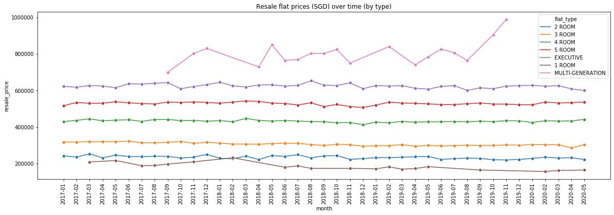
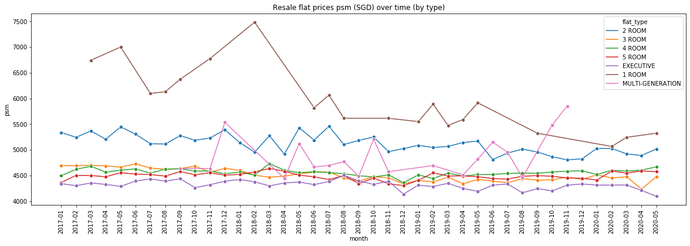
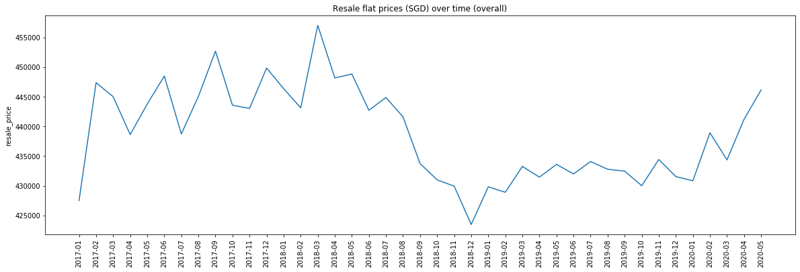
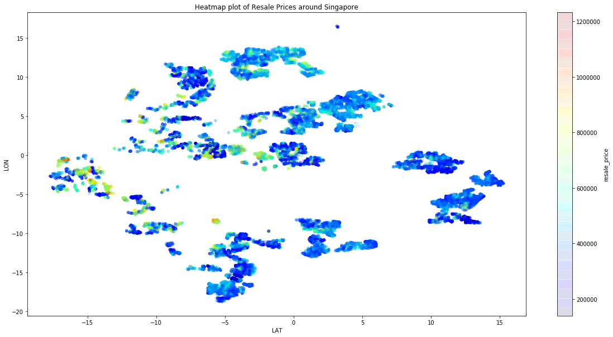
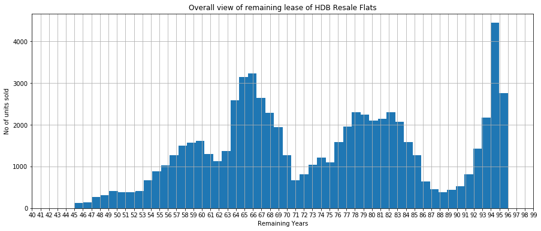

# HDB Resale Price Forecasting
During the summer, I wanted to plan my finances accurately for the future. This meant that I had to begin saving for my future home and I was evaluating between opting for a BTO (Build-To-Order) and Resale flat. Given the selection availability and the speed at which a couple could get the home, I was leaning towards purchasing a resale flat. With this, I was wondering if there was an accurate way that I could project what my future home would cost. This led me to a whole new project to build a machine learning model to enable the price discovery process for me, to evaluate if the seller was over/undercharging me. 

### The Starting Steps
I decided to utilise past resale flat sales data provided by the Singapore government to train my model. This was relatively straight forward (or so I thought), with some simple data preprocessing (standardisation, cleaning, etc) and feature engineering. When considering what features were important, I browsed the internet and noted that the proximity of a housing unit to certain key amenities such as MRTs or Shopping Malls played a crucial role as well. As a result, I ended up building a geocoding pipeline using OneMapAPI, scraping the geocodes of certain key proximities and calculating distances (with the Haversine formula - for the earth was round, not flat), for each housing unit. After doing so, I successfully built up my model and analysed the importance of features.

<b>Details about the model</b>  
Model Architecture: Ensemble model of XGBoost, Clustering and Random Forest  
Model Train MSE: $22,838.97  
Model Test MSE: $31,317.95  

<b>Code you can take for your exploration</b>  
1. [Scraping script for PropertyGuru and 99co](scraper.py)
2. [Preprocessing class for the Government resale flat data](hdb_resale.ipynb)
3. [Geocoding script for geocoding locations](geocoding.py)

### The Next Steps
I wanted to see how agents in the market were selling houses and if they typically started at a fair value. In Singapore, the most well-known agent would be PropertyGuru and to some extent, 99co. I went ahead and scraped their entire website for all resale flats on sale. This was where I countered another problem.   
Both PropertyGuru and 99co were smart by leaving out crucial information on the table, such as the level at which the unit was located (e.g 9th floor). The unit-level was an important feature in dictating prices and while I would ideally overcome that constraint by further scraping the site, I wanted to find a way to keep this project free and sustainable by using free proxy services and I had already hit the free limit. Thus I went ahead and build a new model without the unit level feature and build a mapping script to feed my scraped data into the original model.  

### My Findings
Both PropertyGuru and 99co were priced fairly reasonably for most units with an average overstatement of the price by $30,000. This makes sense as they would require some room for negotiation with the buyer as a part of any sales tactic - to create the illusion of successful negotiation. However, I also found many units that were severely mispriced and thought that it'd be interesting to share them with you.  

<b>[Link](mispriced.csv) to CSV containing mispriced units</b>   
At this juncture, I would like to highlight that the scraped data from PropertyGuru and 99co is highly susceptible to survivorship bias - the reason being that great units that are priced well will sell quickly and tend to not linger on the platform and thus the scraped data will not reflect such units. Hence I would take the overstatement of $30,000 with a pinch of salt.

# Data Summary
If you're still reading, great! Here are the key insights that I've unlocked from the data and I hope it will be as useful for you as it is for me. 

### Insight 1: Prices of resale flats generally do not change over time
My initial hypothesis was that prices would have gradually risen over time in accordance with inflation and simple supply and demand. As it turns out, I was very wrong! The graph below demonstrates the stability of prices, especially for the 3-5 room flats. Even when we consider the per square meter prices, it remains relatively stable. There are sharp jumps in prices for 1 Room flats and Multi-generational flats due to the considerably smaller sample size and thus I would ignore those (also I think that most of us will be interested only in the 3-5 room flats).

### Insight 2: Property cooling measures introduced in 2018 were effective
When we take a look at the overall market prices, we see a decline from about $455,000 to $425,000 in 2018, which can be explained by the measures introduced by the government to keep housing prices from sky rocketing!

### Insight 3: Resale flats tend to be more expensive as you head west
I'm not too sure as for the reason behind this, but I thought it was a very interesting observation! If you have any ideas why this is so, do let me know! 

### Insight 4: There are specific timings that people sell
Now, this is interesting! With the histogram plot, we see that when the remaining lease hits specific years, there tends to be a spike in the number of units sold, especially when it is 95 (given the existing policies stipulate that an owner must stay in his flat for at least 5 years). 

# Closing Thoughts
Given that prices of resale flats are indeed relatively stable over time, I guess that takes much stress off our shoulders having to worry about prices continually inflating. I am fully aware that the data misses out certain key attributes when purchasing a resale flat. 

For instance:
1. The noise level in the surrounding area 
2. North/South/East/West facing unit
3. Quality of neighbours
4. Remaining HDB Racial Quota

All of which will impact prices directly and cause a shift! But given with what I've built up, I'm pretty pleased about it and confident that it will help me to at least conduct a sanity check on prices quoted to me in the future. I hoped that you've enjoyed this mini-write up and project. If you would like to check out my other projects, you can check out my [profile](https://github.com/brandontjd?tab=repositories). Till the next one! 

## Disclaimer
All views and findings presented in my code or repository are my own and do not represent the opinions of any entity whatsoever with which I have been, am now, or will be affiliated. All material provided are for general information purposes only and do not constitute accounting, legal, tax, or other professional advice. Visitors should not act upon the content or information found here without first seeking appropriate advice from an accountant, financial planner, lawyer or other professional. Usage of any material contained within this repository constitutes an explicit understanding and acceptance of the terms of this disclaimer. 
